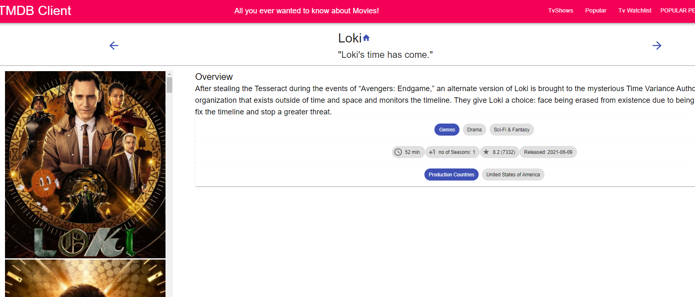

# Assignment - ReactJS app.

Name: Michael Kelly student number 20041540

## Overview.

The additional objectives for the Movies App I eloberated on. Is to implement the tv show section
that will have a watch list feature, The movie list has the favourites feature. The the user will be able to filter tv shows etc. Also I have implemented a login system, that uses FireBase authenthication and Database. Also a popular people section where the user can see there images and then click into view there biography. Also it displays their birthdays and all the movies that they have appeared in. I am going for full storybook support also, so overall i am attempting to tick the box's required.

...... A bullet-point list of user features. If it's the Movies Fan app extension, only list new/modified features...... 
 
 + Tv Show list
 + Tv Show Watchlist
 + Tv Show Reviews
 + Tv Show Details
 + Login
 + Sign Up
 + Sign Out
 + FireBase
 + More StoryBook Support
 + Original component and page designs

## Setup requirements.

...... A brief explanation (to a third party) of any non-standard setup steps necessary to run your app/client locally (after cloning the repo) ........
The setup require ments for third party Database and authentication React FireBase, 
follow these steps:
1. Create an account in Firebase
2. Then you can create project.
3. From their you will be giving credientials.
4. create a file called test-credientials.js
5. enter the credientials you copied form FireBase.
6. The firebase should be then imported in the component your using it in.

## API Data Model.

..... [For non-Movies Fan app] Insert a diagram of the API's data model (see example below) AND/OR a sample(s) of the JSON documents returned by its endpoints ........

![][model]

......[For the Movies Fan app] Specify the additional TMDB endpoints used and show sample responses, in JSON .........
Kids Movies:
https://api.themoviedb.org/3/discover/movie?api_key=${process.env.REACT_APP_TMDB_KEY}&certification_country=US&certification=PG&sort_by=popularity.desc

<------------------------------------------------------------------------------------>
getTvShows: https://api.themoviedb.org/3/discover/tv?api_key=${process.env.REACT_APP_TMDB_KEY}&language=en-US&page=1

{
    "page": 1,
    "results": [
        {
            "adult": false,
            "backdrop_path": null,
            "genre_ids": [
                18
            ],
            "id": 569420,
            "original_language": "en",
            "original_title": "A Christian Carol",
            "overview": "A modern \"Christmas Carol\" from a Christian perspective, with a Dickensian twist.",
            "popularity": 0.6,
            "poster_path": "/fHApq7q4og21Iu0yBlwPm9shWj9.jpg",
            "release_date": "2015-11-01",
            "title": "A Christian Carol",
            "video": false,
            "vote_average": 0,
            "vote_count": 0
        },
        {
            "adult": false,
            "backdrop_path": "/1Shfc1ceGtqQnnZzUoL8QZlZ13r.jpg",
            "genre_ids": [
                28,
                35,
                10751,
                878
            ],
            "id": 11504,
            "original_language": "en",
            "original_title": "Suburban Commando",
            "overview": "Shep Ramsey is an interstellar hero, righting wrongs, etc. His ship is damaged after a fight with an interstellar nasty and he must hide out on Earth until it can recharge. He leaves his power suit at home, but still finds himself unable to allow wrongs to go unrighted and so mixes it up with bad drivers, offensive paperboys, muggers and the like.",
            "popularity": 6.148,
            "poster_path": "/hXAIGWdfxCQ1d5XFGcwudNdgagN.jpg",
            "release_date": "1991-10-04",
            "title": "Suburban Commando",
            "video": false,
            "vote_average": 4.8,
            "vote_count": 118
        },
        {
            "adult": false,
            "backdrop_path": null,
            "genre_ids": [
                35
            ],
            "id": 11505,
            "original_language": "en",
            "original_title": "Family Plan",
            "overview": "A bumbling guy takes a group of orphans to summer camp.",
            "popularity": 1.936,
            "poster_path": "/8LqxB63wHTO45A9fr1ULtDSuwX1.jpg",
            "release_date": "1997-01-01",
            "title": "Family Plan",
            "video": false,
            "vote_average": 5.4,
            "vote_count": 17
        },
        {
            "adult": false,
            "backdrop_path": "/hz95xUI0MhXTpRGjfnT0HkDijtV.jpg",
            "genre_ids": [
                10751,
                35,
                14,
                53,
                10770
            ],
            "id": 11508,
            "original_language": "en",
            "original_title": "Addams Family Reunion",
            "overview": "The Addams Family goes on a search for their relatives. Gomez and Morticia are horrified to discover that Grandpa and Grandma Addams have a disease that is slowly turning them \"normal\". The only chance they have of a cure is to find a family member hoping that they know a home remedy.",
            "popularity": 17.581,
            "poster_path": "/XtfNBKnLDpg1waJhDF5FAd5OEX.jpg",
            "release_date": "1998-09-22",
            "title": "Addams Family Reunion",
            "video": false,
            "vote_average": 4.6,
            "vote_count": 198
        },
        {
            "adult": false,
            "backdrop_path": "/nrgSMYWAYnEg7fKx9diYS75UGkA.jpg",
            "genre_ids": [
                14,
                35,
                10751
            ],
            "id": 11511,
            "original_language": "en",
            "original_title": "Kazaam",
            "overview": "When Max fools a gang of local toughs, he finds himself in big trouble. Fleeing from the thugs, Max runs into an old warehouse and bumps into a boom box. By doing that, he manages to release Kazaam, a genie who has been held captive for thousands of years.",
            "popularity": 7.743,
            "poster_path": "/k6kXq27UVxf7zGCWSvygYYIp9eP.jpg",
            "release_date": "1996-07-17",
            "title": "Kazaam",
            "video": false,
            "vote_average": 4.3,
            "vote_count": 192
        },
        {
            "adult": false,
            "backdrop_path": "/txBOj9EcbRuc39V44sWGg8c3WRh.jpg",
            "genre_ids": [
                18,
                10749
            ],
            "id": 11518,
            "original_language": "hi",
            "original_title": "मोहब्बतें",
            "overview": "At a prestigious all-male university, three friends seek love outside of the school grounds; at the same time, a newly-hired music teacher seeks to befriend and loosen up the militantly strict headmaster.",
            "popularity": 8.298,
            "poster_path": "/zB7zJQgk4pPoxsPzZP0CqUgHuXN.jpg",
            "release_date": "2000-10-27",
            "title": "Mohabbatein",
            "video": false,
            "vote_average": 7,
            "vote_count": 152
        },
        {
            "adult": false,
            "backdrop_path": "/9Fo9s7BtjczN3hpA8wNaMI98PMo.jpg",
            "genre_ids": [
                28,
                35,
                10752
            ],
            "id": 11519,
            "original_language": "en",
            "original_title": "1941",
            "overview": "In the days after the attack on Pearl Harbor, panic grips California, where a military officer leads a mob chasing a Japanese sub.",
            "popularity": 8.826,
            "poster_path": "/npjGnJFPVNnGv2eH52jwMx4g86O.jpg",
            "release_date": "1979-12-14",
            "title": "1941",
            "video": false,
            "vote_average": 5.9,
            "vote_count": 408
        },
        {
            "adult": false,
            "backdrop_path": "/aVznky4yJGmsSwImYH7MjCXtOcm.jpg",
            "genre_ids": [
                18,
                10751
            ],
            "id": 11521,
            "original_language": "en",
            "original_title": "Little Man Tate",
            "overview": "Dede is a sole parent trying to bring up her son Fred. When it is discovered that Fred is a genius, she is determined to ensure that Fred has all the opportunities that he needs, and that he is not taken advantage of by people who forget that his extremely powerful intellect is harboured in the body and emotions of a child.",
            "popularity": 6.412,
            "poster_path": "/bVj97TGirraAQFsefm7Ss5cVuXW.jpg",
            "release_date": "1991-09-06",
            "title": "Little Man Tate",
            "video": false,
            "vote_average": 6.4,
            "vote_count": 174
        },
        {
            "adult": false,
            "backdrop_path": "/m0p2zjOjCZxMzyuKnWEyYvQqvb5.jpg",
            "genre_ids": [
                10751,
                35
            ],
            "id": 11528,
            "original_language": "en",
            "original_title": "The Sandlot",
            "overview": "During a summer of friendship and adventure, one boy becomes a part of the gang, nine boys become a team and their leader becomes a legend by confronting the terrifying mystery beyond the right field wall.",
            "popularity": 17.766,
            "poster_path": "/7PYqz0viEuW8qTvuGinUMjDWMnj.jpg",
            "release_date": "1993-04-07",
            "title": "The Sandlot",
            "video": false,
            "vote_average": 7.5,
            "vote_count": 790
        },
        {
            "adult": false,
            "backdrop_path": "/l4AQWbf41kb13gaXRx1pYHMVjTl.jpg",
            "genre_ids": [
                28,
                35
            ],
            "id": 11537,
            "original_language": "cn",
            "original_title": "蛇形刁手",
            "overview": "Everyone abuses and humiliates a downtrodden orphan (Chan) until he befriends an old man, who turns out to be the last master of the \"snake fist\" fighting style. Jackie becomes the old man's student and finds himself in battle with the master of the \"eagle's claw\" style, who has vowed to destroy the snake fist clan.",
            "popularity": 12.459,
            "poster_path": "/7NhjRt8IgQVKw2FgBP1MzzSu5Qv.jpg",
            "release_date": "1978-03-01",
            "title": "Snake in the Eagle's Shadow",
            "video": false,
            "vote_average": 7.3,
            "vote_count": 215
        },
        {
            "adult": false,
            "backdrop_path": "/hNAmYyBi33qAQkgOoxphdxyWQgU.jpg",
            "genre_ids": [
                10752,
                18,
                10749
            ],
            "id": 11541,
            "original_language": "en",
            "original_title": "The Year of Living Dangerously",
            "overview": "Australian journalist Guy Hamilton travels to Indonesia to cover civil strife in 1965. There—on the eve of an attempted coup—he befriends a Chinese Australian photographer with a deep connection to and vast knowledge of the Indonesian people, and also falls in love with a British national.",
            "popularity": 6.358,
            "poster_path": "/9Nxy4ZGOq43rXqyMXIft1ruemN3.jpg",
            "release_date": "1982-12-17",
            "title": "The Year of Living Dangerously",
            "video": false,
            "vote_average": 6.8,
            "vote_count": 206
        },
        {
            "adult": false,
            "backdrop_path": "/AcxbOWUbwtIEDisfuhNGHQNfnMK.jpg",
            "genre_ids": [
                16,
                10751
            ],
            "id": 11544,
            "original_language": "en",
            "original_title": "Lilo & Stitch",
            "overview": "As Stitch, a runaway genetic experiment from a faraway planet, wreaks havoc on the Hawaiian Islands, he becomes the mischievous adopted alien \"puppy\" of an independent little girl named Lilo and learns about loyalty, friendship, and 'ohana, the Hawaiian tradition of family.",
            "popularity": 73.31,
            "poster_path": "/d73UqZWyw3MUMpeaFcENgLZ2kWS.jpg",
            "release_date": "2002-06-21",
            "title": "Lilo & Stitch",
            "video": false,
            "vote_average": 7.5,
            "vote_count": 4622
        },
        {
            "adult": false,
            "backdrop_path": "/Y8b33EkncHL9mLRVvSPSB2SQol.jpg",
            "genre_ids": [
                35,
                80
            ],
            "id": 11546,
            "original_language": "en",
            "original_title": "Police Academy: Mission to Moscow",
            "overview": "The Russians seek help in dealing with the Mafia from the veterans of the Police Academy. They head off to Moscow, in order to find evidence against Konstantin Konali, who marketed a computer game that everyone in the world is playing.",
            "popularity": 10.875,
            "poster_path": "/3517XQ9LpoEykyYq2TuDNS45MPP.jpg",
            "release_date": "1994-06-09",
            "title": "Police Academy: Mission to Moscow",
            "video": false,
            "vote_average": 4.5,
            "vote_count": 581
        },
        {
            "adult": false,
            "backdrop_path": "/b7HsWYjyrVkDPkAFFAGZ76iainK.jpg",
            "genre_ids": [
                878,
                35,
                10751,
                14
            ],
            "id": 11548,
            "original_language": "en",
            "original_title": "*batteries not included",
            "overview": "In a soon to be demolished block of apartments, the residents resist the criminal methods used to force them to leave so a greedy tycoon can build his new skyscraper. When tiny mechanical aliens land for a recharge, they decide to stay and help out.",
            "popularity": 11.271,
            "poster_path": "/9d7SG5NIFWHQ08TaPAneTbSWAV4.jpg",
            "release_date": "1987-12-18",
            "title": "*batteries not included",
            "video": false,
            "vote_average": 6.7,
            "vote_count": 500
        },
        {
            "adult": false,
            "backdrop_path": "/yLEvFfGVXsStEkNQwi9OxAcCDaa.jpg",
            "genre_ids": [
                35,
                80,
                10749,
                53
            ],
            "id": 11558,
            "original_language": "en",
            "original_title": "Silver Streak",
            "overview": "A somewhat daffy book editor on a rail trip from Los Angeles to Chicago thinks that he sees a murdered man thrown from the train. When he can find no one who will believe him, he starts doing some investigating of his own. But all that accomplishes is to get the killer after him.",
            "popularity": 7.59,
            "poster_path": "/fNOh3ljmTonQ9kuICJhp02bXGDg.jpg",
            "release_date": "1976-12-03",
            "title": "Silver Streak",
            "video": false,
            "vote_average": 6.7,
            "vote_count": 209
        },
        {
            "adult": false,
            "backdrop_path": "/r7cB6j3eawzU4OiKOj8Ap54BSnD.jpg",
            "genre_ids": [
                35,
                10749,
                878
            ],
            "id": 11561,
            "original_language": "en",
            "original_title": "Sleeper",
            "overview": "Miles Monroe, a clarinet-playing health food store proprietor, is revived out of cryostasis 200 years into a future world in order to help rebels fight an oppressive government regime.",
            "popularity": 7.671,
            "poster_path": "/YTYSziZZP5aXt5CDvdEMwKDzme.jpg",
            "release_date": "1973-12-17",
            "title": "Sleeper",
            "video": false,
            "vote_average": 7,
            "vote_count": 562
        },
        {
            "adult": false,
            "backdrop_path": "/hxQch7RR2nheUqIGjgUvB1onYN6.jpg",
            "genre_ids": [
                53,
                12,
                18,
                80
            ],
            "id": 11583,
            "original_language": "en",
            "original_title": "The First Great Train Robbery",
            "overview": "In Victorian England, a master criminal makes elaborate plans to steal a shipment of gold from a moving train.",
            "popularity": 9.101,
            "poster_path": "/56vLMA3Ab4TdclYnFrLTfrbg2ne.jpg",
            "release_date": "1978-12-14",
            "title": "The First Great Train Robbery",
            "video": false,
            "vote_average": 6.7,
            "vote_count": 235
        },
        {
            "adult": false,
            "backdrop_path": "/7Kl87i5C2KUBJH9fUyWOFJu0uFE.jpg",
            "genre_ids": [
                35,
                10749
            ],
            "id": 11584,
            "original_language": "en",
            "original_title": "Roxanne",
            "overview": "Based on the play 'Cyrano de Bergerac', large-nosed C.D. Bales falls for the beautiful Roxanne—while she falls for his personality but another man's looks.",
            "popularity": 8.498,
            "poster_path": "/c2XSGkpAIIof6Oi8Sr6wBvwt1Lk.jpg",
            "release_date": "1987-06-19",
            "title": "Roxanne",
            "video": false,
            "vote_average": 6.4,
            "vote_count": 442
        },
        {
            "adult": false,
            "backdrop_path": "/js7WdYkmPDx8zHX0pgzhNuOTk77.jpg",
            "genre_ids": [
                12,
                35,
                10752
            ],
            "id": 11589,
            "original_language": "en",
            "original_title": "Kelly's Heroes",
            "overview": "A misfit group of World War II American soldiers goes AWOL to rob a bank behind German lines.",
            "popularity": 13.836,
            "poster_path": "/uN77OdpoRpScNYHhIooHEPNoIP3.jpg",
            "release_date": "1970-06-22",
            "title": "Kelly's Heroes",
            "video": false,
            "vote_average": 7.4,
            "vote_count": 483
        },
        {
            "adult": false,
            "backdrop_path": "/r05P0mSFNKIZE7JMMDSxiHPcwAG.jpg",
            "genre_ids": [
                18,
                36
            ],
            "id": 11594,
            "original_language": "fr",
            "original_title": "Notre-Dame de Paris",
            "overview": "Paris, 1482. Today is the festival of the fools, taking place like each year in the square outside Cathedral Notre Dame. Among jugglers and other entertainers, Esmeralda, a sensuous gypsy, performs a bewitching dance in front of delighted spectators. From up in a tower of the cathedral, Frollo, an alchemist, gazes at her lustfully. Later in the night, Frollo orders Quasimodo, the deformed bell ringer and his faithful servant, to kidnap Esmeralda. But when the ugly freak comes close to her is touched by the young woman's beauty...",
            "popularity": 9.443,
            "poster_path": "/bjH6kuTELmGV4S7Ddh3PzlmjShz.jpg",
            "release_date": "1956-12-19",
            "title": "The Hunchback of Notre Dame",
            "video": false,
            "vote_average": 6.5,
            "vote_count": 65
        }
    ],
    "total_pages": 290,
    "total_results": 5786
}
<---------------------------------------------------------------------------------------------------->
getTvShows:
https://api.themoviedb.org/3/tv/${id}?api_key=${process.env.REACT_APP_TMDB_KEY}
{
    "backdrop_path": "/tmTqDRHs3oXdAQApF8G2D3q5GFx.jpg",
    "created_by": [
        {
            "id": 57447,
            "credit_id": "52577083760ee36aaa47992c",
            "name": "Christopher Crowe",
            "gender": 2,
            "profile_path": null
        }
    ],
    "episode_run_time": [
        45,
        60
    ],
    "first_air_date": "1998-10-07",
    "genres": [
        {
            "id": 10765,
            "name": "Sci-Fi & Fantasy"
        },
        {
            "id": 18,
            "name": "Drama"
        }
    ],
    "homepage": "",
    "id": 4562,
    "in_production": false,
    "languages": [
        "en"
    ],
    "last_air_date": "2001-05-29",
    "last_episode_to_air": {
        "air_date": "2001-05-29",
        "episode_number": 22,
        "id": 326838,
        "name": "Live: From Death Row",
        "overview": "Parker causes the delay of an important Backstep mission to go to New Orleans to prove the innocence of an old friend scheduled for execution for a murder he didn't commit.",
        "production_code": "",
        "season_number": 3,
        "still_path": null,
        "vote_average": 0.0,
        "vote_count": 0
    },
    "name": "Seven Days",
    "next_episode_to_air": null,
    "networks": [
        {
            "name": "UPN",
            "id": 40,
            "logo_path": "/333LtWX9Z7H9uRrNcCl1JcTvdpR.png",
            "origin_country": "US"
        }
    ],
    "number_of_episodes": 66,
    "number_of_seasons": 3,
    "origin_country": [
        "US",
        "CA"
    ],
    "original_language": "en",
    "original_name": "Seven Days",
    "overview": "\"Ever wish you could live your last week all over again? Well, my name's Frank B. Parker, and I do it all the time. I work for a secret government project experimenting in time travel. When things really get screwed up, I'm the guinea pig they send back to take care of it. The catch is, I can only go back 7 days.\"",
    "popularity": 17.566,
    "poster_path": "/tDE6WMNv7CujLs5o6UALrPC58HR.jpg",
    "production_companies": [],
    "production_countries": [],
    "seasons": [
        {
            "air_date": "1998-10-07",
            "episode_count": 21,
            "id": 13798,
            "name": "Season 1",
            "overview": "",
            "poster_path": null,
            "season_number": 1
        },
        {
            "air_date": "1999-09-29",
            "episode_count": 23,
            "id": 13799,
            "name": "Season 2",
            "overview": "",
            "poster_path": null,
            "season_number": 2
        },
        {
            "air_date": "2000-10-11",
            "episode_count": 22,
            "id": 13800,
            "name": "Season 3",
            "overview": "",
            "poster_path": null,
            "season_number": 3
        }
    ],
    "spoken_languages": [
        {
            "english_name": "English",
            "iso_639_1": "en",
            "name": "English"
        }
    ],
    "status": "Ended",
    "tagline": "",
    "type": "Scripted",
    "vote_average": 7.2,
    "vote_count": 37
}

<---------------------------------------------------------------------------------->
getPersonMovieCredits: https://api.themoviedb.org/3/person/${id}/movie_credits?api_key=${process.env.REACT_APP_TMDB_KEY}&language=en-US

{
    "page": 1,
    "results": [
        {
            "backdrop_path": "/4N6zEMfZ57zNEQcM8gWeERFupMv.jpg",
            "first_air_date": "2021-08-11",
            "genre_ids": [
                16,
                10759,
                10765
            ],
            "id": 91363,
            "name": "What If...?",
            "origin_country": [
                "US"
            ],
            "original_language": "en",
            "original_name": "What If...?",
            "overview": "Taking inspiration from the comic books of the same name, each episode explores a pivotal moment from the Marvel Cinematic Universe and turns it on its head, leading the audience into uncharted territory.",
            "popularity": 2015.637,
            "poster_path": "/lztz5XBMG1x6Y5ubz7CxfPFsAcW.jpg",
            "vote_average": 8.6,
            "vote_count": 752
        },
        {
            "backdrop_path": "/pXjpqrx65mlQskf9mfTWSszYODn.jpg",
            "first_air_date": "2020-05-18",
            "genre_ids": [
                10765,
                10759,
                18
            ],
            "id": 80986,
            "name": "DC's Stargirl",
            "origin_country": [
                "US"
            ],
            "original_language": "en",
            "original_name": "DC's Stargirl",
            "overview": "Courtney Whitmore, a smart, athletic and above all else kind girl, discovers her step-father has a secret: he used to be the sidekick to a superhero. \"Borrowing\" the long-lost hero’s cosmic staff, she becomes the unlikely inspiration for an entirely new generation of superheroes.",
            "popularity": 1157.03,
            "poster_path": "/rbkGgrEHOPyAEZqPk609QN1Ird6.jpg",
            "vote_average": 8,
            "vote_count": 790
        },
        {
            "backdrop_path": "/f5tjVQtxihaVwXOdpITSPeIqlpX.jpg",
            "first_air_date": "2021-06-09",
            "genre_ids": [
                18,
                10765
            ],
            "id": 84958,
            "name": "Loki",
            "origin_country": [
                "US"
            ],
            "original_language": "en",
            "original_name": "Loki",
            "overview": "After stealing the Tesseract during the events of “Avengers: Endgame,” an alternate version of Loki is brought to the mysterious Time Variance Authority, a bureaucratic organization that exists outside of time and space and monitors the timeline. They give Loki a choice: face being erased from existence due to being a “time variant” or help fix the timeline and stop a greater threat.",
            "popularity": 1140.788,
            "poster_path": "/kEl2t3OhXc3Zb9FBh1AuYzRTgZp.jpg",
            "vote_average": 8.2,
            "vote_count": 7327
        },
        {
            "backdrop_path": "/iDbIEpCM9nhoayUDTwqFL1iVwzb.jpg",
            "first_air_date": "2017-09-25",
            "genre_ids": [
                18
            ],
            "id": 71712,
            "name": "The Good Doctor",
            "origin_country": [
                "US"
            ],
            "original_language": "en",
            "original_name": "The Good Doctor",
            "overview": "A young surgeon with Savant syndrome is recruited into the surgical unit of a prestigious hospital. The question will arise: can a person who doesn't have the ability to relate to people actually save their lives",
            "popularity": 1120.956,
            "poster_path": "/6tfT03sGp9k4c0J3dypjrI8TSAI.jpg",
            "vote_average": 8.6,
            "vote_count": 9175
        },
        {
            "backdrop_path": null,
            "first_air_date": "2011-08-18",
            "genre_ids": [],
            "id": 73106,
            "name": "Celebrity Big Brother's Bit on the Side",
            "origin_country": [
                "GB"
            ],
            "original_language": "en",
            "original_name": "Celebrity Big Brother's Bit on the Side",
            "overview": "The place to catch up on all things Celebrity Big Brother UK! Join Rylan Clark-Neal for the best mix of exclusive clips, news and reactions from the house, plus celebrity guests and live debates in the studio.",
            "popularity": 1386.118,
            "poster_path": "/4zr7J1UrdqiDyhNU2JHiqozUOLQ.jpg",
            "vote_average": 3,
            "vote_count": 2
        },
        {
            "backdrop_path": "/zJZfxi8X3XPHAhxXseRugtnNVtt.jpg",
            "first_air_date": "2013-12-02",
            "genre_ids": [
                16,
                35,
                10765,
                10759
            ],
            "id": 60625,
            "name": "Rick and Morty",
            "origin_country": [
                "US"
            ],
            "original_language": "en",
            "original_name": "Rick and Morty",
            "overview": "Rick is a mentally-unbalanced but scientifically-gifted old man who has recently reconnected with his family. He spends most of his time involving his young grandson Morty in dangerous, outlandish adventures throughout space and alternate universes. Compounded with Morty's already unstable family life, these events cause Morty much distress at home and school.",
            "popularity": 923.065,
            "poster_path": "/8kOWDBK6XlPUzckuHDo3wwVRFwt.jpg",
            "vote_average": 8.8,
            "vote_count": 5164
        },
        {
            "backdrop_path": "/qZtAf4Z1lazGQoYVXiHOrvLr5lI.jpg",
            "first_air_date": "2017-01-26",
            "genre_ids": [
                9648,
                18,
                80
            ],
            "id": 69050,
            "name": "Riverdale",
            "origin_country": [
                "US"
            ],
            "original_language": "en",
            "original_name": "Riverdale",
            "overview": "Set in the present, the series offers a bold, subversive take on Archie, Betty, Veronica and their friends, exploring the surreality of small-town life, the darkness and weirdness bubbling beneath Riverdale’s wholesome facade.",
            "popularity": 885.452,
            "poster_path": "/wRbjVBdDo5qHAEOVYoMWpM58FSA.jpg",
            "vote_average": 8.6,
            "vote_count": 11791
        },
        {
            "backdrop_path": "/rSqKcCgC3FvEqXZiY89OEe2vEov.jpg",
            "first_air_date": "2021-08-06",
            "genre_ids": [
                18,
                10765
            ],
            "id": 95281,
            "name": "S.O.Z: Soldiers or Zombies",
            "origin_country": [
                "ES"
            ],
            "original_language": "es",
            "original_name": "S.O.Z: Soldados o Zombies",
            "overview": "Drug lord Alonso Marroquín escapes from a Mexican prison in an attempt to go into hiding. A US military secret experiment goes wrong and the elite unit from the Mexican Police that is after Marroquín gets infected, creating a new zombie species. The Army and the zombies end up at the drug lord’s hideout and a battle for human survival begins.",
            "popularity": 881.042,
            "poster_path": "/lICAhPifWrXpscCvweCrUdCzCuG.jpg",
            "vote_average": 7.5,
            "vote_count": 279
        },
        {
            "backdrop_path": "/uro2Khv7JxlzXtLb8tCIbRhkb9E.jpg",
            "first_air_date": "2010-10-31",
            "genre_ids": [
                10759,
                18,
                10765
            ],
            "id": 1402,
            "name": "The Walking Dead",
            "origin_country": [
                "US"
            ],
            "original_language": "en",
            "original_name": "The Walking Dead",
            "overview": "Sheriff's deputy Rick Grimes awakens from a coma to find a post-apocalyptic world dominated by flesh-eating zombies. He sets out to find his family and encounters many other survivors along the way.",
            "popularity": 852.499,
            "poster_path": "/w21lgYIi9GeUH5dO8l3B9ARZbCB.jpg",
            "vote_average": 8.1,
            "vote_count": 11371
        },
        {
            "backdrop_path": "/eyG9srihv68ScRdEbJZj66WT4O0.jpg",
            "first_air_date": "2014-10-07",
            "genre_ids": [
                18,
                10765
            ],
            "id": 60735,
            "name": "The Flash",
            "origin_country": [
                "US"
            ],
            "original_language": "en",
            "original_name": "The Flash",
            "overview": "After a particle accelerator causes a freak storm, CSI Investigator Barry Allen is struck by lightning and falls into a coma. Months later he awakens with the power of super speed, granting him the ability to move through Central City like an unseen guardian angel. Though initially excited by his newfound powers, Barry is shocked to discover he is not the only \"meta-human\" who was created in the wake of the accelerator explosion -- and not everyone is using their new powers for good. Barry partners with S.T.A.R. Labs and dedicates his life to protect the innocent. For now, only a few close friends and associates know that Barry is literally the fastest man alive, but it won't be long before the world learns what Barry Allen has become...The Flash.",
            "popularity": 834.151,
            "poster_path": "/lJA2RCMfsWoskqlQhXPSLFQGXEJ.jpg",
            "vote_average": 7.8,
            "vote_count": 8303
        },
        {
            "backdrop_path": "/pnyT1foDmmXTsho2DfxN2ePI8ix.jpg",
            "first_air_date": "2018-06-12",
            "genre_ids": [
                18
            ],
            "id": 80240,
            "name": "The Queen of Flow",
            "origin_country": [
                "CO"
            ],
            "original_language": "es",
            "original_name": "La Reina del Flow",
            "overview": "After spending seventeen years in prison unfairly, a talented songwriter seeks revenge on the men who sank her and killed her family.",
            "popularity": 537.262,
            "poster_path": "/fuVuDYrs8sxvEolnYr0wCSvtyTi.jpg",
            "vote_average": 8,
            "vote_count": 1016
        },
        {
            "backdrop_path": "/ta5oblpMlEcIPIS2YGcq9XEkWK2.jpg",
            "first_air_date": "2016-01-25",
            "genre_ids": [
                80,
                10765
            ],
            "id": 63174,
            "name": "Lucifer",
            "origin_country": [
                "US"
            ],
            "original_language": "en",
            "original_name": "Lucifer",
            "overview": "Bored and unhappy as the Lord of Hell, Lucifer Morningstar abandoned his throne and retired to Los Angeles, where he has teamed up with LAPD detective Chloe Decker to take down criminals. But the longer he's away from the underworld, the greater the threat that the worst of humanity could escape.",
            "popularity": 819.67,
            "poster_path": "/ekZobS8isE6mA53RAiGDG93hBxL.jpg",
            "vote_average": 8.5,
            "vote_count": 9919
        },
        {
            "backdrop_path": "/bjsoOPkViI5WIREQb94XDeXrZlF.jpg",
            "first_air_date": "2021-07-26",
            "genre_ids": [],
            "id": 129936,
            "name": "Ilha Record",
            "origin_country": [
                "BR"
            ],
            "original_language": "pt",
            "original_name": "Ilha Record",
            "overview": "",
            "popularity": 1041.818,
            "poster_path": "/43pX5G2eL4H6EppxVcirMxdkcGN.jpg",
            "vote_average": 1.8,
            "vote_count": 3
        },
        {
            "backdrop_path": "/aGULNElJVpSru19WP2pUjopPX1U.jpg",
            "first_air_date": "2021-07-28",
            "genre_ids": [
                80,
                10766
            ],
            "id": 128252,
            "name": "The Snitch Cartel: Origins",
            "origin_country": [
                "CO"
            ],
            "original_language": "es",
            "original_name": "El cartel de los sapos: El origen",
            "overview": "In Cali during the '60s and '70s, two brothers juggle family, romance and the joint pursuit of a burning ambition: to rule Colombia's drug industry.",
            "popularity": 769.181,
            "poster_path": "/A17Rt6BLHno0puR1QXbsSKhBfA4.jpg",
            "vote_average": 8.1,
            "vote_count": 80
        },
        {
            "backdrop_path": "/usqUuDbYX9OvfeQZwMCBfdvJeYl.jpg",
            "first_air_date": "2021-08-08",
            "genre_ids": [],
            "id": 129231,
            "name": "Dream of Chang'an",
            "origin_country": [
                "CN"
            ],
            "original_language": "zh",
            "original_name": "与君歌",
            "overview": "",
            "popularity": 984.095,
            "poster_path": "/xqmSC7LwdD2xbuIUScZHCzcQHcI.jpg",
            "vote_average": 6.2,
            "vote_count": 3
        },
        {
            "backdrop_path": "/3IIBf6VlwEyKAX4cN2XCM1gKdgM.jpg",
            "first_air_date": "2005-03-27",
            "genre_ids": [
                18
            ],
            "id": 1416,
            "name": "Grey's Anatomy",
            "origin_country": [
                "US"
            ],
            "original_language": "en",
            "original_name": "Grey's Anatomy",
            "overview": "Follows the personal and professional lives of a group of doctors at Seattle’s Grey Sloan Memorial Hospital.",
            "popularity": 702.023,
            "poster_path": "/clnyhPqj1SNgpAdeSS6a6fwE6Bo.jpg",
            "vote_average": 8.2,
            "vote_count": 6572
        },
        {
            "backdrop_path": "/pPKiIJEEcV0E1hpVcWRXyp73ZpX.jpg",
            "first_air_date": "2021-02-23",
            "genre_ids": [
                10765,
                10759,
                18
            ],
            "id": 95057,
            "name": "Superman & Lois",
            "origin_country": [
                "US"
            ],
            "original_language": "en",
            "original_name": "Superman & Lois",
            "overview": "After years of facing megalomaniacal supervillains, monsters wreaking havoc on Metropolis, and alien invaders intent on wiping out the human race, The Man of Steel aka Clark Kent and Lois Lane come face to face with one of their greatest challenges ever: dealing with all the stress, pressures and complexities that come with being working parents in today's society.",
            "popularity": 608.961,
            "poster_path": "/vlv1gn98GqMnKHLSh0dNciqGfBl.jpg",
            "vote_average": 8.3,
            "vote_count": 1167
        },
        {
            "backdrop_path": "/uRIiWJ0MrdNjykxl4mp8mXEi308.jpg",
            "first_air_date": "2018-10-12",
            "genre_ids": [
                10759,
                10765,
                18
            ],
            "id": 75450,
            "name": "Titans",
            "origin_country": [
                "US"
            ],
            "original_language": "en",
            "original_name": "Titans",
            "overview": "A team of young superheroes led by Nightwing (formerly Batman's first Robin) form to combat evil and other perils.",
            "popularity": 573.366,
            "poster_path": "/xKnUNWFsAOaKIviIYBLei02Bauu.jpg",
            "vote_average": 8.1,
            "vote_count": 1665
        },
        {
            "backdrop_path": "/thuQmpI9OZNEUTqkkNsNZVDsgNP.jpg",
            "first_air_date": "2021-06-17",
            "genre_ids": [
                35,
                18
            ],
            "id": 119243,
            "name": "iCarly",
            "origin_country": [
                "US"
            ],
            "original_language": "en",
            "original_name": "iCarly",
            "overview": "Ten years after signing off of one of TV's most iconic shows, Carly, Spencer, and Freddie are back, navigating the next chapter of their lives, facing the uncertainties of life in their twenties.",
            "popularity": 598.495,
            "poster_path": "/s5k4GqTUGXeUdScNrjpYfiQLKHI.jpg",
            "vote_average": 7.7,
            "vote_count": 445
        },
        {
            "backdrop_path": "/qyDlF1U1yayXIUniECmGA1oBwZy.jpg",
            "first_air_date": "2011-06-23",
            "genre_ids": [
                18
            ],
            "id": 37680,
            "name": "Suits",
            "origin_country": [
                "US"
            ],
            "original_language": "en",
            "original_name": "Suits",
            "overview": "While running from a drug deal gone bad, Mike Ross, a brilliant young college-dropout, slips into a job interview with one of New York City's best legal closers, Harvey Specter. Tired of cookie-cutter law school grads, Harvey takes a gamble by hiring Mike on the spot after he recognizes his raw talent and photographic memory.",
            "popularity": 549.232,
            "poster_path": "/vQiryp6LioFxQThywxbC6TuoDjy.jpg",
            "vote_average": 8,
            "vote_count": 2355
        }
    ],
    "total_pages": 500,
    "total_results": 10000
}

{
    "cast": [],
    "crew": [
        {
            "overview": "Popeye is a super-strong, spinach-scarfing sailor man who's searching for his father. During a storm that wrecks his ship, Popeye washes ashore and winds up rooming at the Oyl household, where he meets Olive. Before he can win her heart, he must first contend with Olive's fiancé, Bluto.",
            "release_date": "1980-12-12",
            "poster_path": "/hCCp4pESgYY6uTFARYf4UYV1BdU.jpg",
            "id": 11335,
            "adult": false,
            "backdrop_path": "/asBlZAVjFQDPFADrhrmkOVM6TxK.jpg",
            "genre_ids": [
                28,
                12,
                35,
                10751
            ],
            "vote_count": 431,
            "original_language": "en",
            "original_title": "Popeye",
            "vote_average": 5.4,
            "video": false,
            "title": "Popeye",
            "popularity": 10.696,
            "credit_id": "52fe44289251416c7502adad",
            "department": "Editing",
            "job": "Editor"
        },
        {
            "adult": false,
            "backdrop_path": "/cqUYitpW3nyaAWSyi1AirJ4Qg0E.jpg",
            "genre_ids": [
                80,
                9648
            ],
            "id": 6103,
            "original_language": "en",
            "original_title": "Thirteen at Dinner",
            "overview": "Actress Jane Wilkinson wants a divorce, but her husband, Lord Edgware, refuses. She convinces Hercule Poirot to use his famed tact and logic to make her case. Lord Edgware turns up murdered, a well-placed knife wound at the base of his neck. It will take the precise Poirot to sort out the lies from the alibis - and find the criminal before another victim dies.",
            "poster_path": "/id2wDf7mKgI5oHIRefIz31hhrXC.jpg",
            "release_date": "1985-09-19",
            "title": "Thirteen at Dinner",
            "video": false,
            "vote_average": 5.5,
            "vote_count": 34,
            "popularity": 5.475,
            "credit_id": "52fe443dc3a36847f808a42f",
            "department": "Editing",
            "job": "Editor"
        },
        {
            "overview": "A blind Vietnam vet, trained as a swordfighter, comes to America and helps to rescue the son of a fellow soldier.",
            "release_date": "1989-08-17",
            "adult": false,
            "backdrop_path": "/rrnya09qUcArCReu2Xvy6tedmPu.jpg",
            "vote_count": 284,
            "genre_ids": [
                28,
                53
            ],
            "id": 19124,
            "original_language": "en",
            "original_title": "Blind Fury",
            "poster_path": "/bAkVEo8wEy5Q3oD1OxOXN3ijnP9.jpg",
            "title": "Blind Fury",
            "video": false,
            "vote_average": 6.5,
            "popularity": 14.917,
            "credit_id": "52fe47bc9251416c750a3c8f",
            "department": "Editing",
            "job": "Editor"
        },
        {
            "id": 145979,
            "video": false,
            "vote_count": 4,
            "vote_average": 3.3,
            "title": "Heartbeat",
            "release_date": "1993-02-08",
            "original_language": "en",
            "original_title": "Heartbeat",
            "genre_ids": [
                18,
                10749,
                10770
            ],
            "backdrop_path": "/prs66iluN1jitESP5Caj3lsGY9I.jpg",
            "adult": false,
            "overview": "The beautiful and talented Adrian is a writer for one of America's most popular TV soap operas. She is also pregnant, and when she refuses to abort her baby, Adrian's selfish husband deserts her. It falls to one of the soap opera's producers, the recently divorced Bill, to convince Adrian to give romance a second chance.",
            "poster_path": "/b51MD48rJr8yGyNJgVmlNdlXEhE.jpg",
            "popularity": 1.4,
            "credit_id": "538c93b6c3a368714b002dc1",
            "department": "Editing",
            "job": "Editor"
        },
        {
            "id": 109924,
            "video": false,
            "vote_count": 3,
            "vote_average": 4.3,
            "title": "Mayflower Madam",
            "release_date": "1987-11-15",
            "original_language": "en",
            "original_title": "Mayflower Madam",
            "genre_ids": [
                18
            ],
            "backdrop_path": null,
            "adult": false,
            "overview": "Inspired by the explosive sex-for-sale scandal that rocked Manhattan in 1984, the infamous Sydney Biddle Barrows, a driven young socialite, opens an exclusive escort service catering to the wealthy and affluent. From Sydney's rise to become a million-dollar, modern-day madam to her notorious plummet into bankruptcy and public disgrace, experience a private glimpse into the forbidden world of high-class prostitution-where money talks...pleasure sells...and discretion is everything.",
            "poster_path": "/aAlyjv2lBBXUdRP7Q2EESaCRM7d.jpg",
            "popularity": 1.3,
            "credit_id": "58876f5d92514166680040c8",
            "department": "Editing",
            "job": "Editor"
        },
        {
            "adult": false,
            "backdrop_path": null,
            "genre_ids": [
                80,
                18,
                10770
            ],
            "id": 155239,
            "original_language": "es",
            "original_title": "Midwives",
            "overview": "It's a cold and stormy night, and in a house in rural Vermont, midwife Sibyl Danforth is, together with the father and an assistant, in the middle of a homebirth. As time passes, the woman in labor meets with difficulties and Sibyl concludes that it would be preferable for the woman to deliver her baby in the hospital. Though a dead telephone line and bad weather prevents Sibyl from going anywhere. Black ice and a persisten snowstorm makes transportation an impossibility. Early in the morning, the woman dies from what they believe to be a stroke and in all the chaos, Sibyl promptly decides to do a C-section to save the baby. The baby survives, but the mother is dead and tragedy is obvious. Yet, it's only going to get worse for Sibyl as her assistant is certain that the woman was still alive when Sibyl performed the C-section. Sibyl is charged with manslaughter, brought before the court and her life is and will forever be changed.",
            "poster_path": "/y0tFzAcWbYB0T5OhEJxRvknOE2Z.jpg",
            "release_date": "2001-04-02",
            "title": "Midwives",
            "video": false,
            "vote_average": 6.8,
            "vote_count": 5,
            "popularity": 1.154,
            "credit_id": "58de4602c3a3687c4d00b606",
            "department": "Editing",
            "job": "Editor"
        },
        {
            "adult": false,
            "backdrop_path": null,
            "genre_ids": [
                18,
                10770
            ],
            "id": 117199,
            "original_language": "en",
            "original_title": "Men Don't Tell",
            "overview": "This movie shows another side to spousal abuse that not too many people thought is possible--the husband being abused and the wife the abuser.",
            "poster_path": "/gHkOV4rZY1GdaaogM25b5otztmm.jpg",
            "release_date": "1993-03-14",
            "title": "Men Don't Tell",
            "video": false,
            "vote_average": 5.8,
            "vote_count": 4,
            "popularity": 0.96,
            "credit_id": "59dc8d54c3a36861ec070bf0",
            "department": "Editing",
            "job": "Editor"
        },
        {
            "adult": false,
            "backdrop_path": null,
            "genre_ids": [
                18,
                10770
            ],
            "id": 594680,
            "original_language": "en",
            "original_title": "A Time to Heal",
            "overview": "",
            "poster_path": "/bBleF32lgd6NMpHSpRcLK9w81oc.jpg",
            "release_date": "1994-04-08",
            "title": "A Time to Heal",
            "video": false,
            "vote_average": 10.0,
            "vote_count": 1,
            "popularity": 2.027,
            "credit_id": "5ded7567025764001653573d",
            "department": "Editing",
            "job": "Editor"
        },
        {
            "adult": false,
            "backdrop_path": null,
            "genre_ids": [
                18,
                10770
            ],
            "id": 529418,
            "original_language": "en",
            "original_title": "Taking Back My Life: The Nancy Ziegenmeyer Story",
            "overview": "True story about a rape victim who took a stand that rape is never the victim's fault and inspired many other victims who felt shame about what had happened to them to speak out.",
            "poster_path": "/9qaPxozx4cBBgBXL7eJqkCXJnHj.jpg",
            "release_date": "1992-03-15",
            "title": "Taking Back My Life: The Nancy Ziegenmeyer Story",
            "video": false,
            "vote_average": 6.0,
            "vote_count": 1,
            "popularity": 0.722,
            "credit_id": "5deec5b6dc86470013c60257",
            "department": "Editing",
            "job": "Editor"
        },

getTvShowReviews: https://api.themoviedb.org/3/tv/${id}/reviews?api_key=${process.env.REACT_APP_TMDB_KEY}

people popular
    `https://api.themoviedb.org/3/person/popular?api_key=${process.env.REACT_APP_TMDB_KEY}&language=en-US&page=1`
person
    `https://api.themoviedb.org/3/person/${id}?api_key=${process.env.REACT_APP_TMDB_KEY}`
people images
      `https://api.themoviedb.org/3/person/${id}/images?api_key=${process.env.REACT_APP_TMDB_KEY}`

## App Design.

### Component catalogue.

....... Insert a screenshot from the Storybook UI showing your component catalogue. [For the Movies app, hi-light stories relating to new/modified components - see the example screenshot below] .......

![][stories]

### UI Design.

...... Insert screenshots of the app's views, with appropriate captions (see example below). (For the Movies Fan App, only show the new/modified views) ........

in the login page an error will diplay if wrong login, but if correct you can go to the movies, tv shows people.

You can sign up and become authenticated by FireBase DB

The movie page now have kids and watchlist and review section

>The tvShow selection with filter and watchlist and you can click to see overview

![][ss6]
>This is the people overview and you click to see bio

![][view]
>Shows detailed information on a movie. Clicking the 'Reviews' floating action button will display extracts from critic reviews.

### Routing.

...... Insert a list of the routes supported by your app and state the associated view. If relevant, specify which of the routes require authentication, i.e. protected/private. [For the Movies Fan app, only new routes should be listed.] ......... 

+ GET /blogs - displays all published blogs.
+ POST /blogs (protected) - add a new blog.
+ GET /blogs/:id - displays a particular blog.
+ GET /blogs/:id/comments (protected) - detail view of a particular blog and its comments.
+ etc.
+ etc.

## Independent learning (If relevant).

....... Briefly state any technologies/techniques used in your project codebase that was not covered in the lectures/labs. Provide source code filename (source code excerpts are not required in most cases) references to support your assertions and include references (articles/blogs) ......... 

[model]: ./data.jpg
[view]: ./view.png
[stories]: ./storybook.png
[ss1]: ./ss1.PNG

[ss2]: ./ss2.PNG
[ss3]: ./ss3.PNG
[ss4]: ./ss4.PNG
[ss5]: ./ss5.PNG
[ss6]: ./ss6.PNG
[catalog] ./storybookCatalogue.PNG